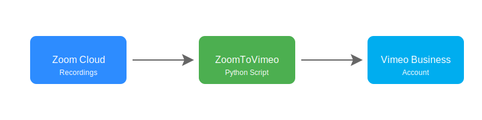

# ZoomToVimeo

[](https://www.python.org/downloads/)
[](https://opensource.org/licenses/MIT)
[](https://marketplace.zoom.us/docs/api-reference/introduction)
[](https://developer.vimeo.com/api/reference)

Automate the process of downloading Zoom cloud recordings and uploading them to Vimeo Business accounts via command line interface.

## Workflow



## Features

### Zoom Downloads
- Download recordings from all users or specific users
- Filter recordings by date
- Select specific recording types (e.g., 'shared_screen_with_speaker_view')
- Local storage of downloaded recordings

### Vimeo Uploads
- Upload to specific folders
- Automatic name sanitization (128-char limit, special character removal)
- Batch processing capabilities

## Prerequisites
- Python 3.6+
- Zoom Developer account with Server-to-Server OAuth app
- Vimeo Business account with OAuth app
- See `reference.txt` for setup guides

## Installation

```bash
git clone https://github.com/alek-tech/ZoomToVimeo
cd ZoomToVimeo
pip3 install -r requirements.txt
```

## Configuration
1. Add Zoom and Vimeo credentials to `.env` file
2. Set `DOWNLOAD_DIRECTORY` in `Main.py`

## Usage

### Basic Operation
Run `python Main.py` and follow the prompts:
1. Specify Vimeo folder ID (optional)
2. Set date filter (optional)
3. Choose operation mode:
   - `all`: Process all users
   - `single`: Process specific users listed in `single_users.xlsx`

### Custom Configuration
- **Single User Mode**: Add user emails to `single_users.xlsx` (Column A)
  - Optionally specify Vimeo folder IDs (Column C)
- **Download-Only Mode**: Comment out `all_upload` or `single_upload` in `Main.py`
- **File Type Filtering**: Modify `get_recordings_files()` in `Functions.py`

## Known Issues
- Interrupted uploads create partial files on Vimeo requiring manual deletion

## Attribution
Based on [zoom-recording-downloader](https://github.com/ricardorodrigues-ca/zoom-recording-downloader), modified for European University requirements.

## License
This project is licensed under the MIT License - see the [LICENSE](LICENSE) file for details.

## Contributing
Contributions are welcome! Please feel free to submit a Pull Request.
